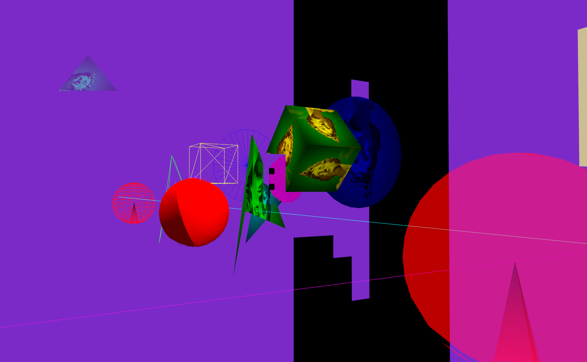

# KaniVolcano

KaniVolcano is a small Rust game engine built on Vulkan.

It is designed around ECS, scenes, and context-based APIs so users can create entities, attach components, register systems, load assets, and draw 2D/3D objects without directly managing Vulkan resources.



## Features

- Vulkan renderer
- ECS-based entity, component, and system workflow
- Scene management
- Primitive and model rendering
- Texture and skybox support
- Input command binding
- User-defined update systems

## Getting Started

See the documentation in:

- `engine/DIRECTIONS_ENG/GettingStarted.md`
- `engine/DIRECTIONS_ENG/AboutThisEngine.md`

## Example
```
[dependencies]
anyhow = "1"
cgmath = "0.18"
pretty_env_logger = "0.5"
kani-volcano-engine = { git = "https://github.com/otinpan/KaniVolcano.git" }
kani-volcano-math = { git = "https://github.com/otinpan/KaniVolcano.git" }
winit = "0.29"
```

```rust
use anyhow::Result;
use kani_volcano::prelude::*;

fn main() -> Result<()> {
    pretty_env_logger::init();

    run(
        EngineConfig {
            title: "Turbo App".to_string(),
            width: 1024,
            height: 768,
        },
        |app| {
            app.create_skybox(20.0)?;
            app.add_scene(MyScene::default())?;
            app.set_current_scene("MyScene")?;
            Ok(())
        },
    )
}
```

## Roadmap

- Font rendering
- Sound support
- Collision systems
- Physics systems
- Shader extension APIs
