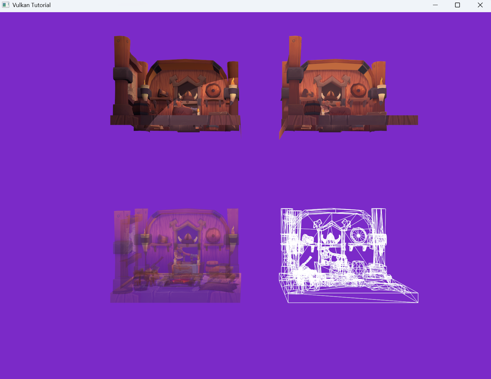
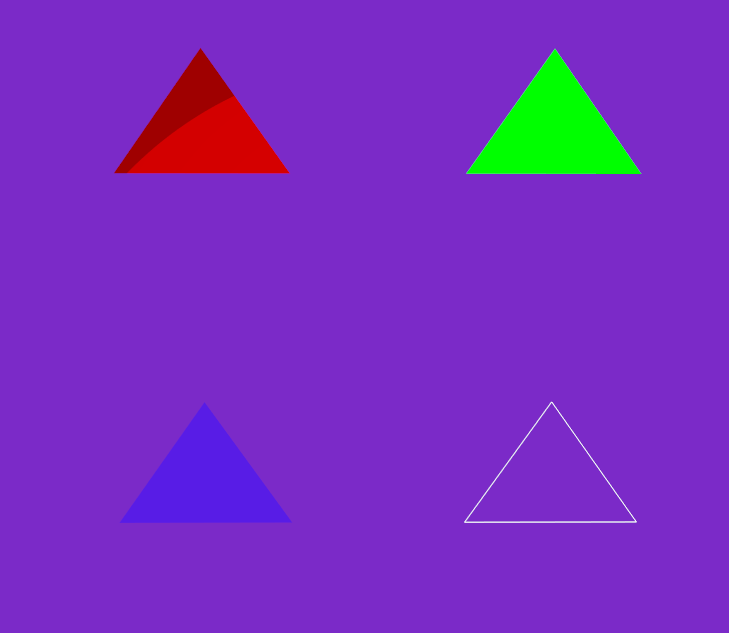
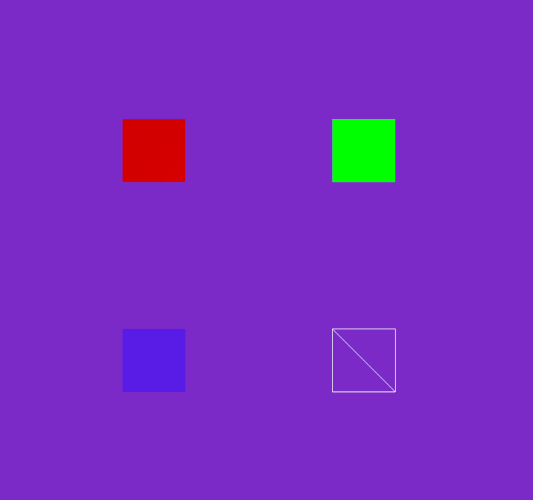
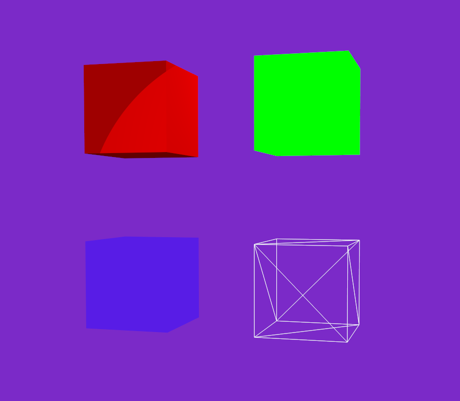
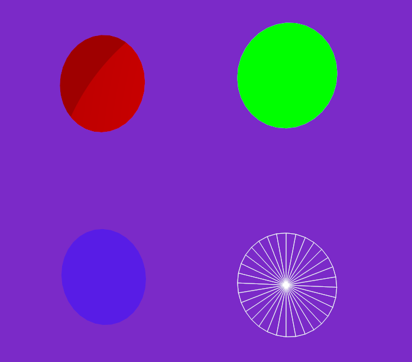
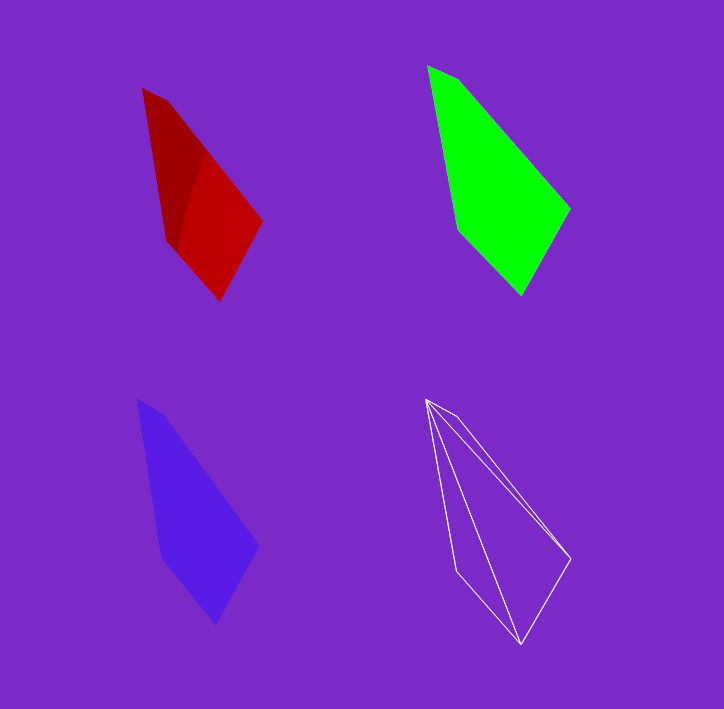
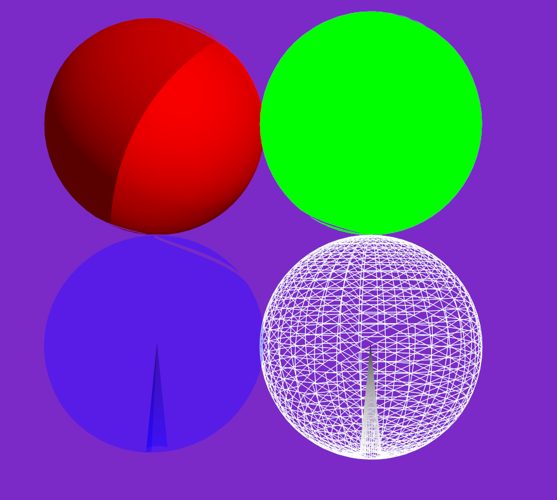
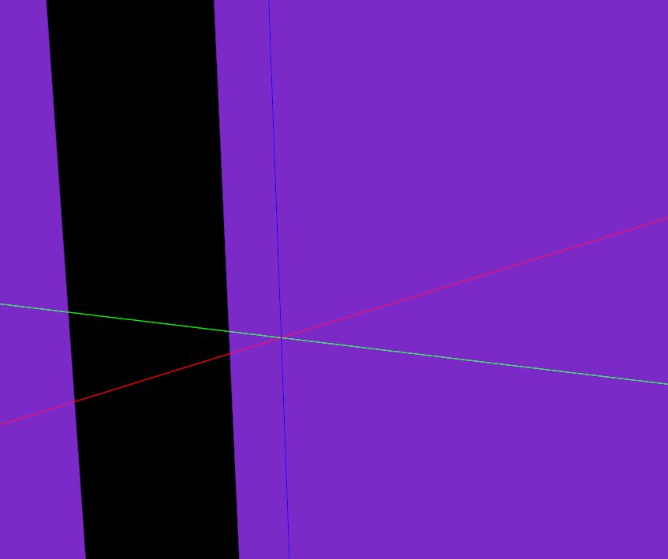
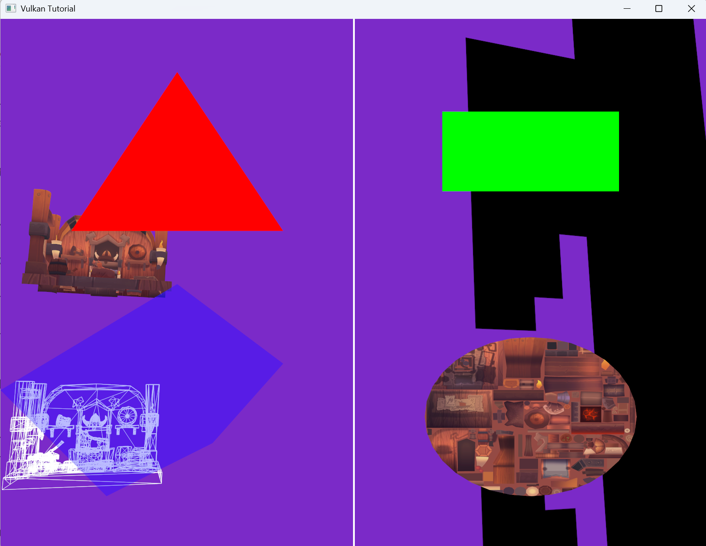

# Object API

Object API creates renderable objects such as models and primitive shapes.

It is available from contexts that implement `ObjectApi`, such as `SceneContext`, `UpdateContext`, and `CommandContext`.

Object API functions usually create an entity and automatically attach the components needed for rendering.

## Models

Models must be loaded from `App` before they can be spawned.

```rust
unsafe {
    app.load_model(
        "viking_room_lit3d",
        "assets/models/viking_room.obj",
        PipelineKey::Lit3D,
        false,
    )?;
}
```

`load_model()` selects a `PipelineKey`, which decides the vertex layout used by the model. The loaded model is registered as a mesh asset.

Spawn the model from a context.

```rust
let texture = context
    .texture("viking_room")
    .unwrap_or(context.default_texture());

context.spawn_model(
    "viking_room_lit3d",
    Transform {
        position: vec3(-3.0, -1.0, 1.0),
        rotation: vec3(0.0, 0.0, 0.0),
        scale: vec3(1.0, 1.0, 1.0),
    },
    Material {
        color: vec3(1.0, 1.0, 1.0),
        alpha: 1.0,
        use_texture: true,
        texture,
        pipeline_key: PipelineKey::Lit3D,
    },
)?;
```



`spawn_model()` attaches these components:

- `Transform`
- `MeshRenderer`
- `Visibility`
- `Tags`: `["Model", model_name]`

The `Material.pipeline_key` must match the pipeline used when the model was loaded.

## Primitive Shapes

Primitive functions create basic shapes.

- `Triangle`
- `Rectangle`
- `Cube`
- `Circle`
- `Polygon`
- `Sphere`
- `Line`

### Triangle

```rust
context.spawn_triangle_3d(
    vec3(-3.0, -1.0, 1.5),
    vec3(-3.0, -1.5, 0.8),
    vec3(-3.0, -0.5, 0.8),
    vec3(1.0, 0.0, 0.0),
    1.0,
    None,
    PipelineKey::Lit3D,
)?;
```



### Rectangle

```rust
context.spawn_rectangle_3d(
    vec3(-3.0, -1.0, 1.0),
    0.6,
    0.6,
    vec3(0.0, 0.0, 0.0),
    vec3(1.0, 0.0, 0.0),
    1.0,
    None,
    PipelineKey::Lit3D,
)?;
```



### Cube

```rust
context.spawn_cube_3d(
    vec3(-3.0, -1.0, 1.0),
    1.0,
    vec3(0.0, 0.0, 0.0),
    vec3(1.0, 0.0, 0.0),
    1.0,
    None,
    PipelineKey::Lit3D,
)?;
```



### Circle

```rust
context.spawn_circle_3d(
    vec3(-3.0, -1.0, 1.0),
    0.5,
    32,
    vec3(1.0, 0.0, 0.0),
    1.0,
    None,
    PipelineKey::Lit3D,
)?;
```



### Polygon

```rust
context.spawn_polygon_3d(
    vec![
        vec3(-3.0, -1.2, 0.9),
        vec3(-3.0, -0.8, 0.5),
        vec3(-3.0, -0.5, 1.0),
        vec3(-3.0, -1.2, 1.8),
        vec3(-3.0, -1.4, 1.9),
    ],
    vec3(1.0, 0.0, 0.0),
    1.0,
    None,
    PipelineKey::Lit3D,
)?;
```



For `Lit3D`, polygon lighting depends on the direction of the normal. If the polygon looks dark, reverse the point order.

### Sphere

```rust
context.spawn_sphere_3d(
    vec3(-3.0, -1.0, 1.0),
    1.0,
    32,
    32,
    vec3(1.0, 0.0, 0.0),
    1.0,
    None,
    PipelineKey::Lit3D,
)?;
```



### Line

```rust
context.spawn_line_3d(
    vec3(-20.0, 0.0, 0.0),
    vec3(20.0, 0.0, 0.0),
    vec3(1.0, 0.0, 0.0),
    1.0,
)?;
```



## 2D UI Primitives

2D primitive functions draw shapes on the screen.

```rust
context.spawn_triangle_2d(
    vec2(-0.5, 0.5),
    vec2(-0.8, -0.2),
    vec2(-0.2, -0.2),
    vec3(1.0, 0.0, 0.0),
    1.0,
    None,
)?;

context.spawn_rectangle_2d(
    vec2(0.5, 0.5),
    0.5,
    0.3,
    0.0,
    vec3(0.0, 1.0, 0.0),
    1.0,
    None,
)?;

context.spawn_circle_2d(
    vec2(0.5, -0.5),
    0.3,
    32,
    vec3(1.0, 1.0, 1.0),
    1.0,
    Some("viking_room"),
)?;
```



## Reusing Existing Primitive Meshes

You can get an existing primitive mesh and create another entity from it.

```rust
let mesh = context
    .primitive_asset_id(
        PrimitiveType::Cube,
        PipelineKey::Lit3D.required_vertex_layout(),
    )
    .ok_or_else(|| anyhow!("cube lit3d mesh not found"))?;

context.spawn_primitive_from_mesh(
    mesh,
    Material {
        color: vec3(1.0, 1.0, 1.0),
        alpha: 1.0,
        use_texture: false,
        texture: context.default_texture(),
        pipeline_key: PipelineKey::Lit3D,
    },
    Transform {
        position: vec3(-3.0, 0.5, 0.5),
        scale: vec3(0.3, 0.3, 0.3),
        ..Default::default()
    },
)?;
```

This reuses the mesh itself. The new entity can still have its own `Transform` and `Material`.

## Notes

`spawn_*_3d()` creates a new primitive mesh through a render command. The mesh is not available immediately in the same function. It becomes available after the render stage processes the command.

If you need a mesh immediately, use a primitive mesh that was already registered at startup, or wait until `primitive_asset_id()` returns `Some`.