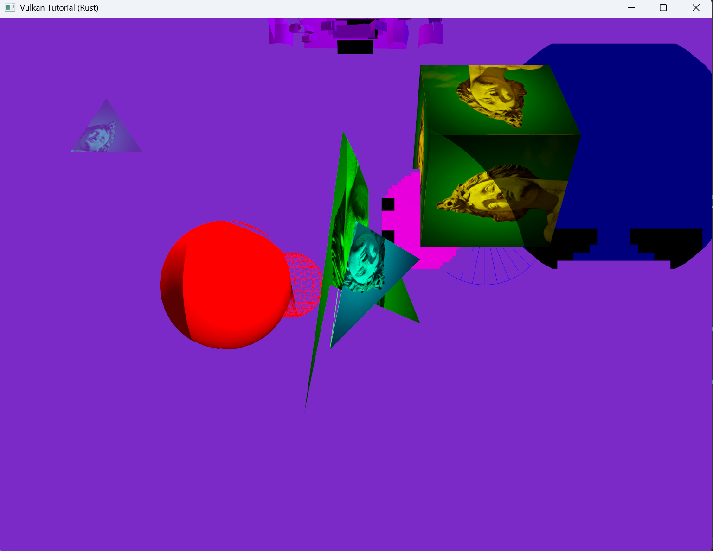

# SceneCommand API

Use the `SceneCommand API` when you want to perform scene-related operations, such as changing the current scene, from a `Command` or an `UpdateSystem`.

KaniVolcano does not switch scenes immediately inside the command itself. Instead, it queues a scene command and applies it later in the app update flow.

## Changing Scenes

Call `set_current_scene()` with the name of the scene you want to move to.

```rust
use anyhow::{Result, anyhow};
use cgmath::vec3;
use kani_volcano_engine::prelude::*;
use kani_volcano_math::Transform;
use winit::keyboard::KeyCode;

pub struct BasicFieldScene {}

impl Scene for BasicFieldScene {
    fn name(&self) -> String {
        "BasicFieldScene".to_string()
    }

    fn on_enter(&mut self, context: &mut SceneContext<'_>) -> Result<()> {
        context.set_skybox("default")?;
        self.create_camera(context)?;
        self.create_foundation(context)?;
        self.add_update_systems(context);
        self.bind_input_commands(context);
        Ok(())
    }

    fn update(&mut self, context: &mut UpdateContext<'_>) -> Result<()> {
        Ok(())
    }
}

impl BasicFieldScene {
    fn create_camera(&mut self, context: &mut SceneContext<'_>) -> Result<()> {
        let camera = context.spawn();
        context.add_component(camera, Transform::default());
        let success = context.add_component(
            camera,
            Camera {
                target: vec3(0.0, 0.0, 0.0),
                fov_y: 45.0,
                near: 0.1,
                far: 100.0,
                yaw: std::f32::consts::PI,
                pitch: 0.0,
            },
        );

        if !success {
            Err(anyhow!("failed to create Camera"))
        } else {
            Ok(())
        }
    }

    fn add_update_systems(&mut self, context: &mut SceneContext<'_>) {
        context.add_update_system("camera", CameraSystem);
    }

    fn create_foundation(&mut self, context: &mut SceneContext<'_>) -> Result<()> {
        context.spawn_rectangle_3d(
            vec3(0.0, 0.0, -1.0),
            30.0,
            30.0,
            vec3(0.0, -90.0, 0.0),
            vec3(0.5, 0.5, 0.5),
            1.0,
            None,
            PipelineKey::Mesh3D,
        )?;

        Ok(())
    }

    fn bind_input_commands(&mut self, context: &mut SceneContext<'_>) {
        context.bind_input_command(
            KeyCode::Space,
            InputTrigger::Pressed,
            ChangeSceneCommand {
                next_scene: "Basic3dScene".to_string(),
            },
        )
    }
}

impl Default for BasicFieldScene {
    fn default() -> Self {
        Self {}
    }
}

pub struct ChangeSceneCommand {
    pub next_scene: String,
}

impl Command for ChangeSceneCommand {
    fn id(&self) -> String {
        "change_scene".to_string()
    }

    fn execute(&self, context: &mut CommandContext<'_>) -> Result<()> {
        context.set_current_scene(self.next_scene.as_str());
        Ok(())
    }
}
```

In this example, pressing `Space` in `BasicFieldScene` changes the current scene to `Basic3dScene`.




When the scene changes, the `UpdateSystem`s and input `Command` bindings registered by the previous scene are reset. Entities with a `SceneOwned` component are also despawned by the default `Scene::on_exit()` implementation.

If you override `on_exit()` in your own scene, the default implementation is replaced. In that case, call `context.despawn_scene_owned_entities()` manually if the scene-owned entities should be removed.
