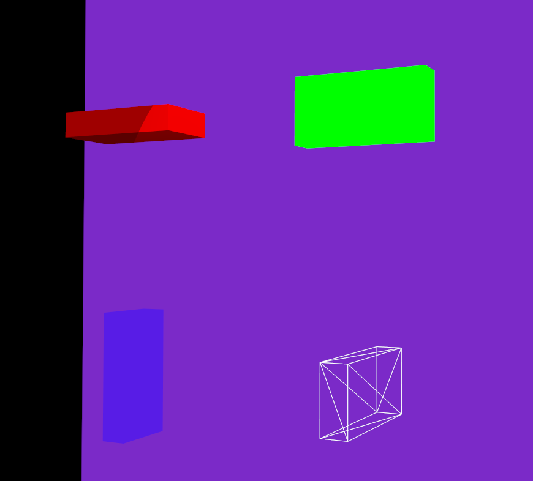
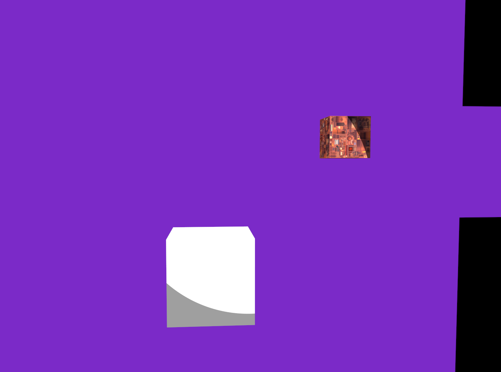

# Object API
ObjectAPIでは主に、画面に表示されるモデル、基本図形の生成を行います。これらの関数では、自動的に描画用のコンポーネント等が付与されます。

## モデルの生成
ロードされたモデルを使用して、ワールドにモデルを生成します。  
#### モデルのロード
まずモデルをロードします。モデルのロードはAppのAPIである、`load_model()`で可能です。
```rust
unsafe{
    // load model from assets/models
    app.load_model(
        "viking_room_lit3d",
        "assets/models/viking_room.obj",
        PipelineKey::Lit3D,
        false,
    )?;

    app.load_model(
        "viking_room_mesh3d",
        "assets/models/viking_room.obj",
        PipelineKey::Mesh3D,
        true,
    )?;

    app.load_model(
        "viking_room_debug_line3d",
        "assets/models/viking_room.obj",
        PipelineKey::DebugLine3D,
        false,
    )?;

    app.load_model(
        "viking_room_transparent_3d",
        "assets/models/viking_room.obj",
        PipelineKey::Transparent3D,
        true,
    )?;
}
```

`load_model()`では、モデルを使用する描画パイプラインを`PipelineKey`で指定します。
この値によって頂点レイアウトが決まり、モデルデータはその形式に合わせてMeshとして読み込まれます。

Meshには、頂点座標やインデックスなど、描画に必要な情報が含まれています。
描画時には、GPUメモリ上に登録されたMeshに対して描画命令が実行されます。

`auto_release`は、そのMeshを参照しているEntityがなくなったときに、自動的にMeshを解放するかどうかを指定する値です。

#### モデルの作成
```rust
fn create_models(&mut self, context: &mut SceneContext<'_>) -> Result<()>{
    let viking_texture=context
        .texture("viking_room")
        .unwrap_or(context.default_texture());

    let viking_room_lit3d=context.spawn_model(
        "viking_room_lit3d",
        Transform { 
            position: vec3(-3.0,-1.0,1.0), 
            rotation: vec3(0.0,0.0,0.0),
            scale: vec3(1.0,1.0,1.0),
        },
        Material { 
            color: vec3(1.0,1.0,1.0),
            alpha: 1.0,
            use_texture: true, 
            texture: viking_texture,
            pipeline_key: PipelineKey::Lit3D // this Pipeline key must match selected model's PipelineKey
        }
    )?;

    let viking_room_mesh3d=context.spawn_model(
        "viking_room_mesh3d",
        Transform { 
            position: vec3(-3.0,1.0,1.0), 
            rotation: vec3(0.0,0.0,0.0), 
            scale: vec3(1.0,1.0,1.0),
        },
        Material { 
            color: vec3(1.0,1.0,1.0),
            alpha: 1.0,
            use_texture: true, 
            texture: viking_texture,
            pipeline_key: PipelineKey::Mesh3D // this Pipeline key must match selected model's PipelineKey
        }
    )?;

    let viking_room_debug_line3d=context.spawn_model(
        "viking_room_debug_line3d",
        Transform { 
            position: vec3(-3.0,1.0,-1.0), 
            rotation: vec3(0.0,0.0,0.0), 
            scale: vec3(1.0,1.0,1.0),
        },
        Material { 
            color: vec3(1.0,1.0,1.0),
            alpha: 1.0,
            use_texture: true, 
            texture: viking_texture,
            pipeline_key: PipelineKey::DebugLine3D // this Pipeline key must match selected model's PipelineKey
        }
    )?;

    let viking_room_transparent3d=context.spawn_model(
        "viking_room_transparent3d",
        Transform { 
            position: vec3(-3.0,-1.0,-1.0), 
            rotation: vec3(0.0,0.0,0.0), 
            scale: vec3(1.0,1.0,1.0),
        },
        Material { 
            color: vec3(1.0,1.0,1.0),
            alpha: 0.5,
            use_texture: true, 
            texture: viking_texture,
            pipeline_key: PipelineKey::Transparent3D // this Pipeline key must match selected model's PipelineKey
        }
    )?;
    Ok(())
}
```


ここでは`SceneContext`を使っていますが、ObjectAPIを実装しているcontextならどれでも`spawn_model()`で、ロードしたモデルからモデルを作成できます。`spawn_model()`で作られたオブジェクトには
* `Transform`
* `MeshRenderer`
* `Visibility`
* `Tag`: ["Model", model_name]

のコンポーネントが付与されます。

## 基本図形の生成
`spawn_triangle_3d()`のようなAPIで基本図形を描画できます。現段階ではこれらの基本図形を扱えます。
* Triangle: 三角形
* Rectangle: 四角形
* Cube: 立方体
* Circle: 円
* Polygon: 多角形
* Sphere: 球
* Line: 線分

### Triangle: 三角形の生成
```rust
fn create_triangles(&mut self, context: &mut SceneContext<'_>) -> Result<()>{
    let items=vec![
        (vec3(-3.0,-1.0,1.0),vec3(1.0,0.0,0.0),1.0,PipelineKey::Lit3D),
        (vec3(-3.0,1.0,1.0),vec3(0.0,1.0,0.0),1.0,PipelineKey::Mesh3D),
        (vec3(-3.0,1.0,-1.0),vec3(1.0,1.0,1.0),1.0,PipelineKey::DebugLine3D),
        (vec3(-3.0,-1.0,-1.0),vec3(0.0,0.0,1.0),0.5,PipelineKey::Transparent3D),
    ];
    for item in items{
        let triangle=context.spawn_triangle_3d(
            item.0+vec3(0.0,0.0,0.5), // vertex
            item.0+vec3(0.0,-0.5,-0.2), // vertex
            item.0+vec3(0.0,0.5,-0.2), // vertex
            item.1, // color
            item.2, // alpha
            None, // texture
            item.3, // PipelineKey
        );
    }
    Ok(())
}
```


### Rectangle: 四角形の生成
```rust
fn create_rectangles(&mut self, context: &mut SceneContext<'_>) -> Result<()>{
    let items=vec![
        (vec3(-3.0,-1.0,1.0),vec3(1.0,0.0,0.0),1.0,PipelineKey::Lit3D),
        (vec3(-3.0,1.0,1.0),vec3(0.0,1.0,0.0),1.0,PipelineKey::Mesh3D),
        (vec3(-3.0,1.0,-1.0),vec3(1.0,1.0,1.0),1.0,PipelineKey::DebugLine3D),
        (vec3(-3.0,-1.0,-1.0),vec3(0.0,0.0,1.0),0.5,PipelineKey::Transparent3D),
    ];

    for item in items{
        let rectangle=context.spawn_rectangle_3d(
            item.0, // position
            0.6, // width
            0.6, // height
            vec3(0.0,0.0,0.0), // rotation
            item.1, // color
            item.2, // alpha
            None, //texture
            item.3, // PipelineKey
        );
    }

    Ok(())
}
```


### Cube: 立方体の生成
```rust
fn create_cubes(&mut self, context: &mut SceneContext<'_>) -> Result<()>{
    let items=vec![
        (vec3(-3.0,-1.0,1.0),vec3(1.0,0.0,0.0),1.0,PipelineKey::Lit3D),
        (vec3(-3.0,1.0,1.0),vec3(0.0,1.0,0.0),1.0,PipelineKey::Mesh3D),
        (vec3(-3.0,1.0,-1.0),vec3(1.0,1.0,1.0),1.0,PipelineKey::DebugLine3D),
        (vec3(-3.0,-1.0,-1.0),vec3(0.0,0.0,1.0),0.5,PipelineKey::Transparent3D),
    ];

    for item in items{
        let cube=context.spawn_cube_3d(
            item.0, // position
            1.0, // length
            vec3(0.0,0.0,0.0), // rotation
            item.1, // color
            item.2, // alpha
            None, // texture
            item.3, // PipelineKey
        );
    }
    Ok(())
}
```


### Cuboid: 直方体の生成
```rust
fn create_cuboids(&mut self, context: &mut SceneContext<'_>) -> Result<()>{
    let items=vec![
        (vec3(-3.0,-1.0,1.0),0.5,0.2,1.0,vec3(1.0,0.0,0.0),1.0,PipelineKey::Lit3D),
        (vec3(-3.0,1.0,1.0),0.2,0.5,1.0,vec3(0.0,1.0,0.0),1.0,PipelineKey::Mesh3D),
        (vec3(-3.0,1.0,-1.0),1.0,0.5,0.2,vec3(1.0,1.0,1.0),1.0,PipelineKey::DebugLine3D),
        (vec3(-3.0,-1.0,-1.0),0.5,1.0,0.2,vec3(0.0,0.0,1.0),0.5,PipelineKey::Transparent3D),
    ];

    for item in items{
        let cuboid=context.spawn_cuboid_3d(
            item.0, // position
            item.1, // width
            item.2, // depth
            item.3, // height
            vec3(0.0,0.0,0.0), // rotation
            item.4, // color
            item.5, // alpha
            None, // texture
            item.6 // PipelineKey
        );
    }

    Ok(())
}
```



### Circle: 円の生成
```rust
fn create_circles(&mut self, context: &mut SceneContext<'_>) -> Result<()>{
    let items=vec![
        (vec3(-3.0,-1.0,1.0),vec3(1.0,0.0,0.0),1.0,PipelineKey::Lit3D),
        (vec3(-3.0,1.0,1.0),vec3(0.0,1.0,0.0),1.0,PipelineKey::Mesh3D),
        (vec3(-3.0,1.0,-1.0),vec3(1.0,1.0,1.0),1.0,PipelineKey::DebugLine3D),
        (vec3(-3.0,-1.0,-1.0),vec3(0.0,0.0,1.0),0.5,PipelineKey::Transparent3D),
    ];
    
    for item in items{
        let circle=context.spawn_circle_3d(
            item.0, // position
            0.5, // radius
            32, // segments
            item.1, // color
            item.2, // alpha
            None, // texture
            item.3 // PipelineKey
        );
    }

    Ok(())
} 
```


### Polygon: 多角形の生成
```rust
fn create_polygons(&mut self, context: &mut SceneContext<'_>) -> Result<()>{
    let items=vec![
        (vec3(-3.0,-1.0,1.0),vec3(1.0,0.0,0.0),1.0,PipelineKey::Lit3D),
        (vec3(-3.0,1.0,1.0),vec3(0.0,1.0,0.0),1.0,PipelineKey::Mesh3D),
        (vec3(-3.0,1.0,-1.0),vec3(1.0,1.0,1.0),1.0,PipelineKey::DebugLine3D),
        (vec3(-3.0,-1.0,-1.0),vec3(0.0,0.0,1.0),0.5,PipelineKey::Transparent3D),
    ];

    for item in items{
        let polygon=context.spawn_polygon_3d(
            vec![
                item.0 + vec3(0.0, -0.2, -0.1),
                item.0 + vec3(0.0, 0.2, -0.5),
                item.0 + vec3(0.0, 0.5, 0.0),
                item.0 + vec3(0.0, -0.2, 0.8),
                item.0 + vec3(0.0, -0.4, 0.9),
            ], // position counter clockwise
            item.1, // color
            item.2, // alpha
            None, // texture
            item.3 // PipelineKey
        );
    }
    Ok(())
}
```


### Sphere: 球の生成
```rust
fn create_spheres(&mut self, context: &mut SceneContext<'_>) -> Result<()>{
    let items=vec![
        (vec3(-3.0,-1.0,1.0),vec3(1.0,0.0,0.0),1.0,PipelineKey::Lit3D),
        (vec3(-3.0,1.0,1.0),vec3(0.0,1.0,0.0),1.0,PipelineKey::Mesh3D),
        (vec3(-3.0,1.0,-1.0),vec3(1.0,1.0,1.0),1.0,PipelineKey::DebugLine3D),
        (vec3(-3.0,-1.0,-1.0),vec3(0.0,0.0,1.0),0.5,PipelineKey::Transparent3D),
    ];

    for item in items{
        let sphere=context.spawn_sphere_3d(
            item.0,
            1.0,
            32,
            32,
            item.1,
            item.2,
            None,
            item.3
        );
    }

    Ok(())
}
```


### Line: 線分の生成
```rust
fn create_lines(&mut self, context: &mut SceneContext<'_>) -> Result<()>{
    let line_x=context.spawn_line_3d(
        vec3(-20.0,0.0,0.0),
        vec3(20.0,0.0,0.0),
        vec3(1.0,0.0,0.0),
        1.0
    );
    let line_y=context.spawn_line_3d(
        vec3(0.0,-20.0,0.0),
        vec3(0.0,20.0,0.0),
        vec3(0.0,1.0,0.0),
        1.0
    );
    let line_x=context.spawn_line_3d(
        vec3(0.0,0.0,-20.0),
        vec3(0.0,0.0,20.0),
        vec3(0.0,0.0,1.0),
        1.0
    );

    Ok(())
}
```


## UIの描画
2Dの図形を一番手前に描画させることが出来ます。UI作成時に便利です。
* 三角形
* 四角形
* 円
* ポリゴン

```rust
fn create_2d_primitives(&mut self, context: &mut SceneContext<'_>) -> Result<()>{
    let items=vec![
        (vec2(-0.5,0.5),vec3(1.0,0.0,0.0),1.0),
        (vec2(0.5,0.5),vec3(0.0,1.0,0.0),1.0),
        (vec2(0.5,-0.5),vec3(1.0,1.0,1.0),1.0),
        (vec2(-0.5,-0.5),vec3(0.0,0.0,1.0),0.5),
    ];

    let triangle=context.spawn_triangle_2d(
        items[0].0+vec2(0.0,0.3), // pos0
        items[0].0+vec2(-0.3,-0.3), // pos1
        items[0].0+vec2(0.3,-0.3), // pos2
        items[0].1, // color
        items[0].2, // alpha
        None, // texture
    );

    let rectangle=context.spawn_rectangle_2d(
        items[1].0, // position
        0.5, // width
        0.3, // height
        0.0, // rotation
        items[1].1, // color
        items[1].2, // alpha
        None, // texture
    );

    let circle=context.spawn_circle_2d(
        items[2].0, // position
        0.3, // radius
        32, // segments
        items[2].1, // color
        items[2].2, // alpha
        Some("viking_room"), // texture
    );

    let polygon=context.spawn_polygon_2d(
        vec![
            items[3].0+vec2(0.3,0.2),
            items[3].0+vec2(0.0,0.5),
            items[3].0+vec2(-0.5,0.1),
            items[3].0+vec2(-0.2,-0.3),
            items[3].0+vec2(0.1,-0.1),
        ], // points
        items[3].1, // color
        items[3].2, // alpha
        None, // texture
    );

    let line=context.spawn_line_2d(
        vec2(0.0,1.0), // edge
        vec2(0.0,-1.0), // edge
        vec3(1.0,1.0,1.0), // color
        0.005, // width
        1.0, // alpha
    );
    Ok(())
}
```


## MeshAssetIdを指定して描画
`spawn_primitive_from_mesh()`は`MeshAssetId`を指定し、すでに生成されたMeshを使って基本図形を複製することができます。
```rust
if self.cube_mesh_ready && !self.double_created {
    if let Some(mesh) = context.primitive_asset_id(
        PrimitiveType::Cube,
        PipelineKey::Lit3D.required_vertex_layout(),
    ) {
        let texture=context.texture("viking_room")
        .unwrap_or(context.default_texture());
        context.spawn_primitive_from_mesh(
            mesh,
            Material {
                color: vec3(1.0, 1.0, 1.0),
                alpha: 1.0,
                use_texture: true,
                texture: texture,
                pipeline_key: PipelineKey::Lit3D,
            },
            Transform {
                position: vec3(-3.0, 0.5, 0.5),
                scale: vec3(0.5, 0.5, 0.5),
                ..Default::default()
            },
        )?;

        self.double_created = true;
    }
}
```

引数には、`MeshAssetId`、`Material`、`Transform`を取り、描画方法と座標情報を設定します。

```rust
fn create_doubles(&mut self, context: &mut SceneContext<'_>) -> Result<()>{
    let cube=context.spawn_cube_3d(
        vec3(-3.0,0.0,0.0),
        0.3,
        vec3(0.0,0.0,0.0),
        vec3(1.0,1.0,1.0),
        1.0,
        None,
        PipelineKey::Lit3D,
    );
    let mesh = context
        .primitive_asset_id(
            PrimitiveType::Cube,
            PipelineKey::Lit3D.required_vertex_layout(),
        )
        .ok_or_else(|| anyhow!("cube lit3d mesh not found"))?;

    let cube = context.spawn_primitive_from_mesh(
        mesh,
        Material {
            color: vec3(1.0, 1.0, 1.0),
            alpha: 1.0,
            use_texture: false,
            texture: context.default_texture(),
            pipeline_key: PipelineKey::Lit3D,
        },
        Transform {
            position: vec3(-3.0, 0.5, 0.5),
            scale: vec3(0.3, 0.3, 0.3),
            ..Default::default()
        },
    )?;
    Ok(())
}
```

`Scene::on_enter()`内で、これを呼ぶとコンパイルエラーになります。
```
Error: cube lit3d mesh not found
error: process didn't exit successfully: `target\debug\kani_volcano_tutorial.exe` (exit code: 1)
```
なぜでしょう。一見すると、`spawn_cube3d()`でEntityとメッシュを作成しているから、そこで使用した`MeshAssetId`も使用可能になりそうですが、実は、`context.spawn_primitive_from_mesh()`を呼んだ時点では、メッシュは作られていません。KaniVolcanoでは、Vulkan側にデータを送信する命令は、RenderCommandQueueに入れられ、フレームの終わりにまとめて送信されます。なので、1フレーム以上待ってから、`spawn_primitive_from_mesh()`を呼ぶ必要があります。
```rust
pub struct TutorialScene{
    pub cube_mesh_ready: bool,
    pub double_created: bool,
}

impl Scene for TutorialScene{
    fn name(&self) -> String {
        "TutorialScene".to_string()
    }

    fn on_enter(&mut self, context: &mut SceneContext<'_>) -> Result<()>{
        context.set_skybox("ghost_skybox")?;
        self.create_camera(context)?;
        self.create_cube()?;

        Ok(())
    }
    fn update(&mut self, context: &mut UpdateContext<'_>) -> Result<()> {
        if self.cube_mesh_ready && !self.double_created {
            if let Some(mesh) = context.primitive_asset_id(
                PrimitiveType::Cube,
                PipelineKey::Lit3D.required_vertex_layout(),
            ) {
                let texture=context.texture("viking_room")
                .unwrap_or(context.default_texture());
                context.spawn_primitive_from_mesh(
                    mesh,
                    Material {
                        color: vec3(1.0, 1.0, 1.0),
                        alpha: 1.0,
                        use_texture: true,
                        texture: texture,
                        pipeline_key: PipelineKey::Lit3D,
                    },
                    Transform {
                        position: vec3(-3.0, 0.5, 0.5),
                        scale: vec3(0.5, 0.5, 0.5),
                        ..Default::default()
                    },
                )?;

                self.double_created = true;
            }
        }else{
            self.cube_mesh_ready=true;
        }

        Ok(())
    }

    fn on_exit(&mut self, context: &mut SceneContext<'_>) -> Result<()>{
        context.despawn_scene_owned_entities();
        Ok(())
    }

}

impl TutorialScene{
    fn create_camera(&mut self, context: &mut SceneContext<'_>) -> Result<()>{
        let camera=context.spawn();
        context.add_component(
            camera,
            Transform{
                position: vec3(5.0,0.0,0.0),
                ..Default::default()
            }
        );
        context.add_component(
            camera,
            Camera{
                target: vec3(0.0,0.0,0.0),
                fov_y: 45.0,
                near: 0.1, // if objects are within `near`, they are not rendered.
                far: 100.0, // if objects are far than `far`, they are not rendered.
                yaw: std::f32::consts::PI, // horizontal way to move
                pitch: 0.0, // vertical way to move
            },
        );
        Ok(())
    }

    fn create_cube(&mut self, context: &mut SceneContext<'_>) -> Result<()>{
        let cube=context.spawn_cube_3d(
            vec3(-3.0,0.0,0.0),
            0.3,
            vec3(0.0,0.0,0.0),
            vec3(1.0,1.0,1.0),
            1.0,
            None,
            PipelineKey::Lit3D,
        );
        Ok(())
    }
}
```

