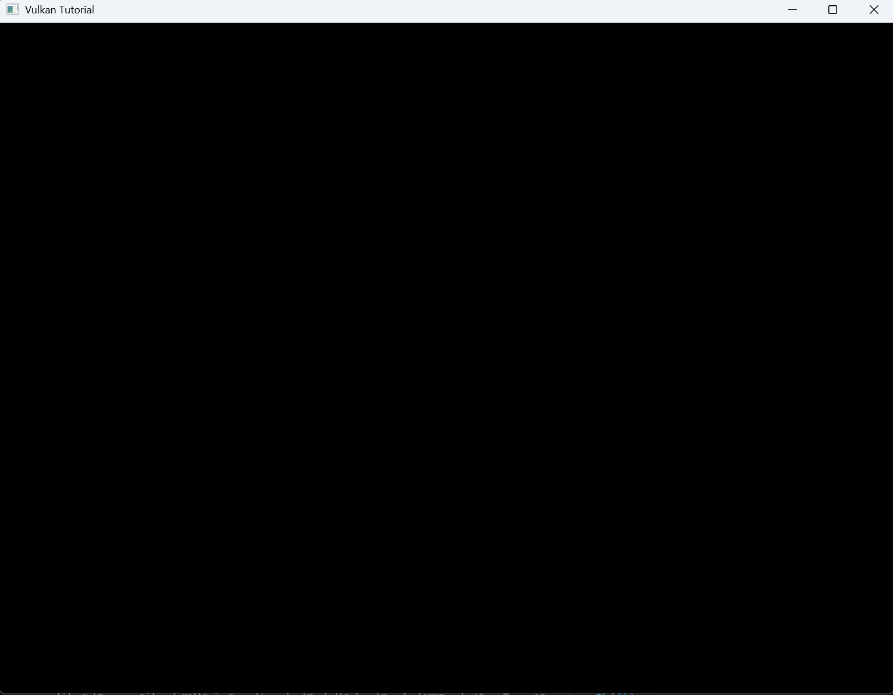
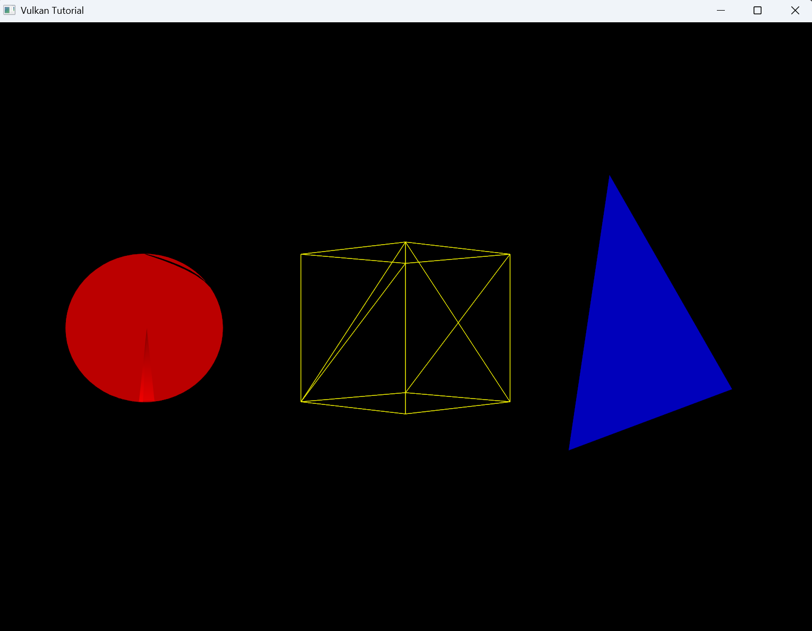
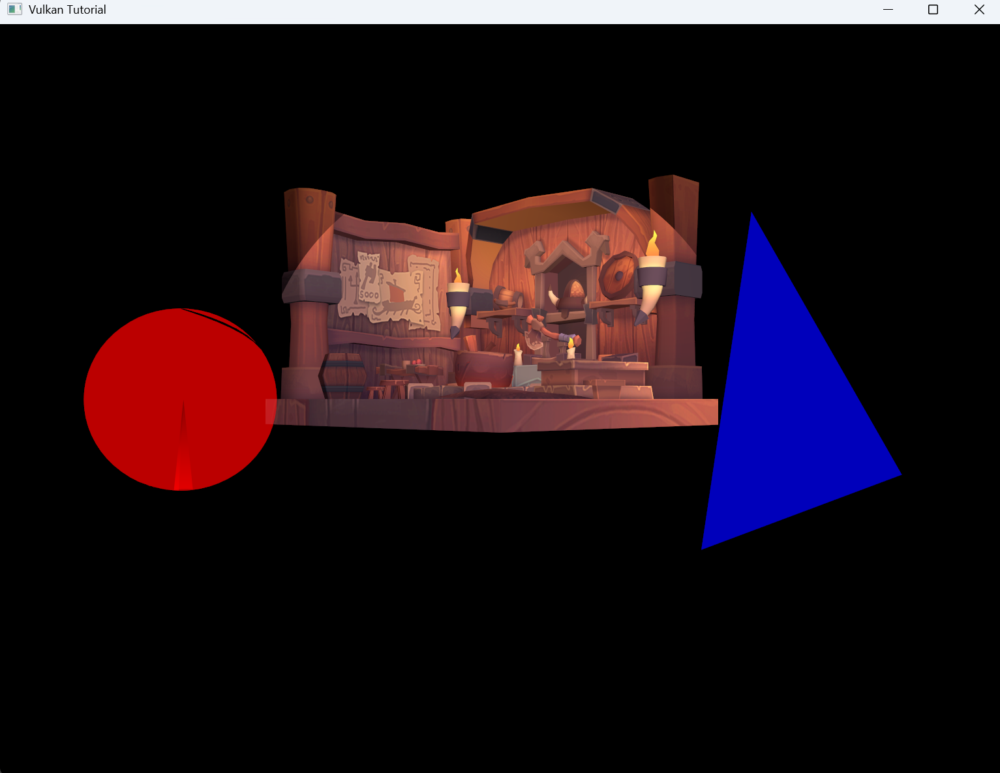
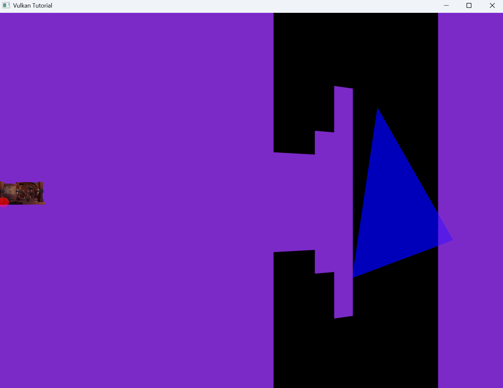

# チュートリアル
まずTurboEngineを使えるようにしましょう。`Cargo.toml`に以下を加えてください。
```
[dependencies]
anyhow = "1"
cgmath = "0.18"
pretty_env_logger = "0.5"
turbo_engine = { git = "https://github.com/otinpan/turbo" }
turbo_math = { git = "https://github.com/otinpan/turbo" }
winit = "0.29"
```

`main.rs`を編集して、ビルドしてみましょう
```rust
use anyhow::{Result};
use turbo_engine::prelude::*;
fn main()  -> Result<()>{
    pretty_env_logger::init();
    run(
        EngineConfig {
            title: "Vulkan Tutorial".to_string(), 
            width: 1024, 
            height: 768
        },
        |app|{
            Ok(())
        }
    )
}
```
`run`関数を呼び出します。1つ目の引数では`EngineConfig`でwindowのタイトル、幅、高さを設定します。第2引数ではクロージャを呼び出します。今後はここでモデルや画像のロード、シーンの登録などを記述していきます。この段階でビルドしてみましょう。おそらく１分くらいかかりますが成功するはずです。
```
PS D:\MyGame\turbo_tutorial> cargo build
   Compiling turbo_tutorial v0.1.0 (D:\MyGame\turbo_tutorial)
```
では`cargo run`で実行してみましょう。
```
The vertical field of view cannot be below zero, found: 0.0 rad
note: run with `RUST_BACKTRACE=1` environment variable to display a backtrace
error: process didn't exit successfully: `target\debug\turbo_tutorial.exe` (exit code: 101)The vertical field of view cannot be below zero, found: 0.0 rad
```
panicしてしまいました。この原因は、Sceneとカメラをまだ作っていないからです。ではSceneを作成し、その中でカメラを作りましょう。Sceneとはゲーム内の1つの画面や場面をまとめて管理する単位です。`tutorial_scene.rs`に`TutorialScene`として作りましょう。
```rust
pub struct TutorialScene{}

impl Scene for TutorialScene{
    fn name(&self) -> String {
        "TutorialScene".to_string()
    }

    // this is called when this scene is spawned.
    fn on_enter(&mut self, context: &mut SceneContext<'_>) -> Result<()>{
        // Entity作成
        let camera=context.spawn();

        // Component付与
        context.add_component(
            camera,
            Transform{
                position: vec3(1.0,0.0,0.0),
                ..Default::default()
            }
        );
        context.add_component(
            camera,
            Camera{
                target: vec3(0.0,0.0,0.0),
                fov_y: 45.0,
                near: 0.1, // if objects are within `near`, they are not rendered.
                far: 100.0, // if objects are far than `far`, they are not rendered.
                yaw: std::f32::consts::PI, // horizontal way to move
                pitch: 0.0, // vertical way to move
            },
        );
        Ok(())
    }

    // this is called every frame.
    fn update(&mut self, context: &mut UpdateContext<'_>) -> Result<()>{
        Ok(())
    }

    // this is called, when this scene is despawed.
    fn on_exit(&mut self, context: &mut SceneContext<'_>) -> Result<()>{
        Ok(())
    }

}
```

Sceneは`Scene`トレイトを持つ構造体として作ります。`Scene`トレイトは
* `name()`: このSceneの名前を返す関数
* `on_enter()`: このSceneに切り替わったときに呼ばれる関数
* `update()`: このScene特有の更新関数。毎フレーム呼ばれる
* `on_exit()`: このSceneから他のSceneに切り替わる際に呼ばれる関数

を実装します。固定カメラを作るだけなので、`on_enter()`にカメラを作成します。
```rust
let camera=context.spwan();
```
でEntityを作成します。この時点では、ただIdを作成しただけなのでカメラの機能はありません。次に、Componentを付与します。
```rust
context.add_component(
    camera,
    Transform{
        position: vec3(1.0,0.0,0.0),
        ..Default::default()
    }
);
context.add_component(
    camera,
    Camera{
        target: vec3(0.0,0.0,0.0),
        fov_y: 45.0,
        near: 0.1, // if objects are within `near`, they are not rendered.
        far: 100.0, // if objects are far than `far`, they are not rendered.
        yaw: std::f32::consts::PI, // horizontal way to move
        pitch: 0.0, // vertical way to move
    },
);
```
`add_component(entity, component)`でEntityに対してComponentを付与します。カメラは`Transform`コンポーネントと`Camera`コンポーネントを持つ必要があります。この2つを持って初めてカメラとして画面を描画するのです。これは、このエンジンが`Transform`と`Camera`コンポーネントを持つ、Entityの座標情報から画面の見方をVulkanに伝えているからです。
main関数に作ったSceneを加えましょう。
```rust
fn main()  -> Result<()>{
    pretty_env_logger::init();
    run(
        EngineConfig {
            title: "Vulkan Tutorial".to_string(), 
            width: 1200, 
            height: 600
        },
        |app|{
            app.add_scene(TutorialScene{})?;
            app.set_current_scene("TutorialScene")?;
            Ok(())
        }
    )
}
```
`add_scene()`でSceneを登録し、`set_current_scene()`で登録されたSceneを適用します。実行すると以下のようにwindowが作成されます。


## 図形
しかし、これでは面白くないですね。図形を作成しましょう。  
`on_enter()`に図形を作成します。
```rust
fn on_enter(&mut self, context: &mut SceneContext<'_>) -> Result<()>{
    self.create_camera(context)?;

    let sphere=context.spawn_sphere_3d(
        vec3(-1.0,-0.7,0.0), // center
        0.2, // radius
        32, // rings
        32, // segments
        vec3(1.0,0.0,0.0), // color
        0.5, // alpha
        None, // texture
        PipelineKey::Transparent3D, // pipeline
    );
    let cube=context.spawn_cube_3d(
        vec3(-1.0,0.0,0.0), // center
        0.4, // length
        vec3(0.0,0.0,45.0), // rotation
        vec3(1.0,1.0,0.0), // color
        1.0, // alpha
        None, // texture
        PipelineKey::DebugLine3D, // pipeline
    );
    let triangle=context.spawn_triangle_2d(
        vec2(0.5,0.5), // vertex0
        vec2(0.8,-0.2), // vertex1
        vec2(0.4,-0.4), // vertex2
        vec3(0.0,0.0,1.0), // color
        0.5, // alpha
        None, // texture
    );
    Ok(())
}
```
するとこのように描画されるはずです。


ここでは詳しいことは述べませんが、位置や色、透明度、texture等を指定することで簡単に図形を作成し描画させることが出来ます。 

## モデル・画像 
次はモデルと画像をロードして描画してみましょう。まずは`main.rs`でモデルと画像をロードします。
```rust
...
    |app|{
        load_assets(app)?;
        app.add_scene(TutorialScene{})?;
        app.set_current_scene("TutorialScene")?;
        Ok(())
    }

...
fn load_assets(app: &mut App) -> Result<()>{
    unsafe{
        // load model from assets/models
        app.load_model(
            "viking_room_lit3d",
            "assets/models/viking_room.obj",
            PipelineKey::Lit3D,
            false,
        )?;

        // load textures from assets/textures/
        app.load_texture(
            "ghost",
            "assets/textures/ghost.png",
        )?;
        app.load_texture(
            "viking_room",
            "assets/textures/viking_room.png",
        )?;
    }

    Ok(())
}
```
そしてSceneでモデル用のEntityを作成します。
```rust
fn on_enter(&mut self, context: &mut SceneContext<'_>) -> Result<()>{
    self.create_camera(context)?;
    self.create_primitives(context)?;

    let viking_texture=context
        .texture("viking_room")
        .unwrap_or(context.default_texture());

    let viking_room=context.spawn_model(
        "viking_room_lit3d",
        Transform { 
            position: vec3(-3.0,0.0,0.0), 
            rotation: vec3(0.0,0.0,-45.0),
            scale: vec3(1.0,1.0,1.0),
        },
        Material { 
            color: vec3(1.0,1.0,1.0),
            alpha: 1.0,
            use_texture: true, 
            texture: viking_texture,
            pipeline_key: PipelineKey::Lit3D // this Pipeline key must match selected model's PipelineKey
        }
    );

    Ok(())
}
```


`spawn_model(model_name, Transform, Material)`でロードしたモデルを作成します。これも先ほどのカメラや図形同様、EntityでありComponentも自動的に付与されています。`Material`とはどのように描画するかをしてします。ここで大事なのは、Materialフィールドの`model_name`と`pipeline`が`load_model()`で指定したモデルの名前と`pipeline`で一致している必要があるということです。これが一致していなかったら、描画されません。また、`viking_texture`を指定していますが、
```rust
let viking_texture=context
    .texture("viking_room")
    .unwrap_or(context.default_texture());
```
画像がまだ登録されていなかったら、真っ白な画像が適用されます。  

## 背景
次は背景を作ってみましょう。背景を作る前に、背景を張る箱庭を作る必要があります。  
`main.rs`
```rust
|app|{
    app.create_skybox(20.0)?;
```
次にskyboxに張る画像をロードします。skyboxに張る画像は縦横同じサイズの正方形の画像である必要があります。
```rust
// load skybox texture.
// need to select 6 textures
app.load_skybox_texture(
    "ghost_skybox",
    [
        "assets/textures/ghost.png",
        "assets/textures/ghost.png",
        "assets/textures/ghost.png",
        "assets/textures/ghost.png",
        "assets/textures/ghost.png",
        "assets/textures/ghost.png",
    ],
)?;
```

そして、Sceneで、ロードしたskybox_textureをskyboxに貼り付けます。
```rust
fn on_enter(&mut self, context: &mut SceneContext<'_>) -> Result<()> {
    context.set_skybox("ghost_skybox")?;
```
すると背景に`ghost.pnt`が張られます。



### カメラの操作
次にカメラを動かしてみましょう。カメラは`Camera`と`Transform`コンポーネントを持っています。本来ならこれらに対してSystemを作る必要がありますが、Turboはデフォルトでカメラのシステムを用意しています。
```rust
fn on_enter(&mut self, context: &mut SceneContext<'_>) -> Result<()>{
    ...
    self.create_camera(context)?;
    context.add_update_system("camera",CameraSystem);
    ... 
    Ok(())
}
```

Systemを追加するには、`context.add_update_system(name, System)`を呼びます。実行してみるとカメラが動くはずです。 
* AWSD↑↓: 移動
* 右クリックマウス操作: カメラ移動

## ComponentとSystemの作成
では実際にComponentとSystemを作って登録してみましょう。まずはComponentを作りましょう。新しく`MoveComponent`を作る場合`Component`トレイトを実装させます。今回`MoveComponent`には速度を持たせます。

```rust
pub struct MoveComponent{
    pub velocity: cgmath::Vector3<f32>,
}

impl Component for MoveComponent{

}
```

次に`MoveSystem`を作ります。Systemには`UpdateSystem`トレイトを実装させます。今回`MoveSystem`は`Transform`と`MoveComponent`というコンポーネントを持つEntityに対して動作を定義します。下の例では、ただ`MoveComponent`が持つ速度に対して、等速直線運動をさせます。

```rust
#[derive(Clone, Debug)]
pub struct MoveSystem;

impl UpdateSystem for MoveSystem{
    fn update(&mut self, context: &mut UpdateContext<'_>) -> Result<()>{
        let delta_time=context.delta_seconds();

        for (_,transform_c,move_c) in context.query2_mut_mut::<Transform,MoveComponent>(){
            let delta=move_c.velocity*delta_time;
            transform_c.translate(delta);
        }
        Ok(())
    }
}
```

このようにComponentとSystemが作れたら、最後にこれらを登録します。
```rust
let sphere=context.spawn_sphere_3d(
    vec3(-1.0,-0.7,0.0), // center
    0.2, // radius
    32, // rings
    32, // segments
    vec3(1.0,0.0,0.0), // color
    0.5, // alpha
    None, // texture
    PipelineKey::Transparent3D, // pipeline
)?;
context.add_component(
    sphere,
    MoveComponent{
        velocity: vec3(0.0,0.2,0.0)
    }
);
```
`add_component(entity, component)`でEntityにComponentを付与した後、カメラ同様`MoveSystem`を登録することでSystemを適用します。
```rust
fn add_update_systems(&mut self, context: &mut SceneContext<'_>){
    context.add_update_system("camera",CameraSystem);
    context.add_update_system("move",MoveSystem);
}
```
するとMoveComponentを付与したEntityが等速直線運動するはずです。


## Commandの作成
ただ描画して動かすのを見るだけでは楽しくないです。ユーザーのキー操作やマウス操作にフックしてインタラクティブに動作させたいです。そんなとき、Commandを作成します。
```rust
struct CreateRectangleCommand{
    len: f32,
    color: Vec3,
    alpha: f32,
    texture: Option<&'static str>,
    pipeline_key: PipelineKey,
}

impl Command for CreateRectangleCommand{
    fn id(&self) -> String{
        format!("create_rectangle")
    }

    fn execute(&self, context: &mut CommandContext<'_>) -> Result<()>{
        let position=mouse_position_on_spawn_plane(context);
        context.spawn_rectangle_3d(
            position,
            self.len,
            self.len,
            vec3(0.0,0.0,0.0),
            self.color,
            self.alpha,
            self.texture,
            self.pipeline_key,
        )?;
        Ok(())
    }
}

fn mouse_position_on_spawn_plane(context: &CommandContext<'_>) ->Vec3{
    let mouse=context.mouse_position();
    let window_size=context.window_size();
    let width=window_size.x.max(1.0);
    let height=window_size.y.max(1.0);
    let aspect=width/height;
    let world_height=4.0;

    let x=mouse.x/width-0.5;
    let y=0.5-mouse.y/height;

    vec3(-3.0,x*world_height*aspect,y*world_height)
}
```

Commandはユーザーが自由に定義できる構造体で、`Command`トレイトを持ちます。`Command`トレイトはコマンドの名前`id()`とコマンドが実行されたときの処理`execute()`を実装する必要があります。
```rust
fn bind_input_commands(&mut self, context: &mut SceneContext<'_>){
    context.bind_input_command(
        KeyCode::Digit1,
        InputTrigger::Pressed,
        CreateRectangleCommand{
            len: 0.2,
            color: vec3(1.0,0.0,0.0),
            alpha: 1.0,
            texture: None,
            pipeline_key: PipelineKey::Mesh3D,
        }
    );
    context.bind_input_command(
        KeyCode::Digit2,
        InputTrigger::Pressed,
        CreateRectangleCommand{
            len: 0.3,
            color: vec3(0.0,1.0,0.0),
            alpha: 0.5,
            texture: None,
            pipeline_key: PipelineKey::Transparent3D,
        }
    );
    context.bind_input_command(
        KeyCode::Digit3,
        InputTrigger::Pressed,
        CreateRectangleCommand{
            len: 0.1,
            color: vec3(1.0,1.0,1.0),
            alpha: 1.0,
            texture: Some("ghost"),
            pipeline_key: PipelineKey::Lit3D,
        }
    );
    context.bind_input_command(
        KeyCode::Digit4,
        InputTrigger::Pressed,
        CreateRectangleCommand{
            len: 0.2,
            color: vec3(0.0,0.0,1.0),
            alpha: 1.0,
            texture: None,
            pipeline_key: PipelineKey::DebugLine3D,
        }
    );
}
```
登録するときは、上のように`bind_input_command(KeyCode, InputTrigger, Command)` とキーとイベント、そして定義したコマンドを指定します。この場合、
* キー1が押されたら: 一辺の長さ0.2、赤色の正方形
* キー2が押されたら: 一辺の長さ0.3、緑色、半透明の正方形
* キー3が押されたら: 一辺の長さ0.1、ghostの画像が張られた正方形
* キー4が押されたら: 一辺の長さ0.4、青色、線で描画された正方形

が描画されます。Systemと同じように、Commandでコンポーネントを指定し、そのコンポーネントを持つEntityに対して動作を定義することもできます。

## `on_exit()`
Scene内で作られたEntityには、このScene内で作られたというラベルが張られています。もし、このSceneで作られたEntityをScene切り替え時に解放したい場合は`on_exit()`で以下のようにしましょう。
```rust
fn on_exit(&mut self, context: &mut SceneContext<'_>) -> Result<()>{
    context.despawn_scene_owned_entities();
    Ok(())
}
```

## コード
/* わざわざファイルに分ける必要はないです */  
`main.rs`
```rust
use anyhow::{Result};
use turbo_engine::prelude::*;
use turbo_tutorial::TutorialScene;
fn main()  -> Result<()>{
    pretty_env_logger::init();
    run(
        EngineConfig {
            title: "Vulkan Tutorial".to_string(), 
            width: 1024, 
            height: 768,
        },
        |app|{
            app.create_skybox(20.0)?;
            load_assets(app)?;
            app.add_scene(TutorialScene{})?;
            app.set_current_scene("TutorialScene")?;
            Ok(())
        }
    )
}


fn load_assets(app: &mut App) -> Result<()>{
    unsafe{
        // load model from assets/models
        app.load_model(
            "viking_room_lit3d",
            "assets/models/viking_room.obj",
            PipelineKey::Lit3D,
            false,
        )?;

        // load textures from assets/textures/
        app.load_texture(
            "ghost",
            "assets/textures/ghost.png",
        )?;
        app.load_texture(
            "viking_room",
            "assets/textures/viking_room.png",
        )?;

        // load skybox texture.
        // need to select 6 textures
        app.load_skybox_texture(
            "ghost_skybox",
            [
                "assets/textures/ghost.png",
                "assets/textures/ghost.png",
                "assets/textures/ghost.png",
                "assets/textures/ghost.png",
                "assets/textures/ghost.png",
                "assets/textures/ghost.png",
            ],
        )?;
    }

    Ok(())
}
```

`tutorial_scene.rs`
```rust
use cgmath::{vec3,vec2};
use anyhow::{Result};
use turbo_engine::prelude::*;
use turbo_math::Transform;
use winit::keyboard::KeyCode;
use crate::{MoveComponent, MoveSystem};

type Vec3=cgmath::Vector3<f32>;
pub struct TutorialScene{}

impl Scene for TutorialScene{
    fn name(&self) -> String {
        "TutorialScene".to_string()
    }

    fn on_enter(&mut self, context: &mut SceneContext<'_>) -> Result<()>{
        context.set_skybox("ghost_skybox")?;
        self.create_camera(context)?;
        self.create_primitives(context)?;
        self.bind_input_commands(context);
        self.create_models(context)?;
        self.add_update_systems(context);

        Ok(())
    }

    fn update(&mut self, context: &mut UpdateContext<'_>) -> Result<()>{
        Ok(())
    }

    fn on_exit(&mut self, context: &mut SceneContext<'_>) -> Result<()>{
        context.despawn_scene_owned_entities();
        Ok(())
    }

}

impl TutorialScene{
    fn create_camera(&mut self, context: &mut SceneContext<'_>) -> Result<()>{
        let camera=context.spawn();
        context.add_component(
            camera,
            Transform{
                position: vec3(0.0,0.0,0.0),
                ..Default::default()
            }
        );
        context.add_component(
            camera,
            Camera{
                target: vec3(0.0,0.0,0.0),
                fov_y: 45.0,
                near: 0.1, // if objects are within `near`, they are not rendered.
                far: 100.0, // if objects are far than `far`, they are not rendered.
                yaw: std::f32::consts::PI, // horizontal way to move
                pitch: 0.0, // vertical way to move
            },
        );
        Ok(())
    }

    fn create_primitives(&mut self, context: &mut SceneContext<'_>) -> Result<()>{
        let sphere=context.spawn_sphere_3d(
            vec3(-1.0,-0.7,0.0), // center
            0.2, // radius
            32, // rings
            32, // segments
            vec3(1.0,0.0,0.0), // color
            0.5, // alpha
            None, // texture
            PipelineKey::Transparent3D, // pipeline
        )?;
        context.add_component(
            sphere,
            MoveComponent{
                velocity: vec3(0.0,0.2,0.0)
            }
        );
        /* 
        let cube=context.spawn_cube_3d(
            vec3(-1.0,0.0,0.0), // center
            0.4, // length
            vec3(0.0,0.0,45.0), // rotation
            vec3(1.0,1.0,0.0), // color
            1.0, // alpha
            None, // texture
            PipelineKey::DebugLine3D, // pipeline
        );
        */
        let triangle=context.spawn_triangle_2d(
            vec2(0.5,0.5), // vertex0
            vec2(0.8,-0.2), // vertex1
            vec2(0.4,-0.4), // vertex2
            vec3(0.0,0.0,1.0), // color
            0.5, // alpha
            None, // texture
        )?;
        context.add_component(
            triangle,
            MoveComponent{
                velocity: vec3(0.0,0.0,0.2)
            }
        );
        Ok(())
    }

    fn create_models(&mut self, context: &mut SceneContext<'_>) -> Result<()>{
        let viking_texture=context
            .texture("viking_room")
            .unwrap_or(context.default_texture());

        let viking_room=context.spawn_model(
            "viking_room_lit3d",
            Transform { 
                position: vec3(-3.0,0.0,0.0), 
                rotation: vec3(0.0,0.0,-45.0),
                scale: vec3(1.0,1.0,1.0),
            },
            Material { 
                color: vec3(1.0,1.0,1.0),
                alpha: 1.0,
                use_texture: true, 
                texture: viking_texture,
                pipeline_key: PipelineKey::Lit3D // this Pipeline key must match selected model's PipelineKey
            }
        )?;
        context.add_component(
            viking_room,
            MoveComponent{
                velocity: vec3(0.2,0.0,0.2)
            }
        );
        Ok(())
    }

    fn add_update_systems(&mut self, context: &mut SceneContext<'_>){
        context.add_update_system("camera",CameraSystem);
        context.add_update_system("move",MoveSystem);
    }

    fn bind_input_commands(&mut self, context: &mut SceneContext<'_>){
        context.bind_input_command(
            KeyCode::Digit1,
            InputTrigger::Pressed,
            CreateRectangleCommand{
                len: 0.2,
                color: vec3(1.0,0.0,0.0),
                alpha: 1.0,
                texture: None,
                pipeline_key: PipelineKey::Mesh3D,
            }
        );
        context.bind_input_command(
            KeyCode::Digit2,
            InputTrigger::Pressed,
            CreateRectangleCommand{
                len: 0.3,
                color: vec3(0.0,1.0,0.0),
                alpha: 0.5,
                texture: None,
                pipeline_key: PipelineKey::Transparent3D,
            }
        );
        context.bind_input_command(
            KeyCode::Digit3,
            InputTrigger::Pressed,
            CreateRectangleCommand{
                len: 0.1,
                color: vec3(1.0,1.0,1.0),
                alpha: 1.0,
                texture: Some("ghost"),
                pipeline_key: PipelineKey::Lit3D,
            }
        );
        context.bind_input_command(
            KeyCode::Digit4,
            InputTrigger::Pressed,
            CreateRectangleCommand{
                len: 0.2,
                color: vec3(0.0,0.0,1.0),
                alpha: 1.0,
                texture: None,
                pipeline_key: PipelineKey::DebugLine3D,
            }
        );
    }
}


struct CreateRectangleCommand{
    len: f32,
    color: Vec3,
    alpha: f32,
    texture: Option<&'static str>,
    pipeline_key: PipelineKey,
}

impl Command for CreateRectangleCommand{
    fn id(&self) -> String{
        format!("create_rectangle")
    }

    fn execute(&self, context: &mut CommandContext<'_>) -> Result<()>{
        let position=mouse_position_on_spawn_plane(context);
        context.spawn_rectangle_3d(
            position,
            self.len,
            self.len,
            vec3(0.0,0.0,0.0),
            self.color,
            self.alpha,
            self.texture,
            self.pipeline_key,
        )?;
        Ok(())
    }
}

fn mouse_position_on_spawn_plane(context: &CommandContext<'_>) ->Vec3{
    let mouse=context.mouse_position();
    let window_size=context.window_size();
    let width=window_size.x.max(1.0);
    let height=window_size.y.max(1.0);
    let aspect=width/height;
    let world_height=4.0;

    let x=mouse.x/width-0.5;
    let y=0.5-mouse.y/height;

    vec3(-3.0,x*world_height*aspect,y*world_height)
}
```

`move_component.rs`
```rust
use turbo_engine::*;
pub struct MoveComponent{
    pub velocity: cgmath::Vector3<f32>,
}

impl Component for MoveComponent{

}
```

`move_system.rs`
```rust
use turbo_engine::*;
use turbo_math::Transform;
use anyhow::{Result};
use crate::{MoveComponent};


#[derive(Clone, Debug)]
pub struct MoveSystem;

impl UpdateSystem for MoveSystem{
    fn update(&mut self, context: &mut UpdateContext<'_>) -> Result<()>{
        let delta_time=context.delta_seconds();

        for (_,transform_c,move_c) in context.query2_mut_mut::<Transform,MoveComponent>(){
            let delta=move_c.velocity*delta_time;
            transform_c.translate(delta);
        }
        Ok(())
    }
}
```